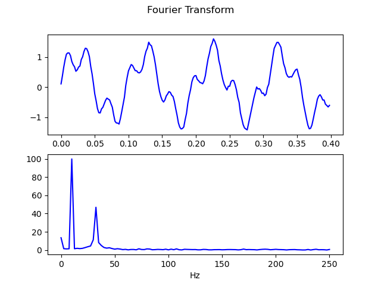

### plotting for ngn/k
defines a concise interface to generate charts

uses python's matplotlib, but can define other drivers keeping the same interface



```
sudo apt install python3-matplotlib
git clone https://github.com/effbiae/plot.k.git
cd plot.k
k eg.k
```
see [eg.k](eg.k)'s output [here](https://effbiae.github.io/plot.k/)
